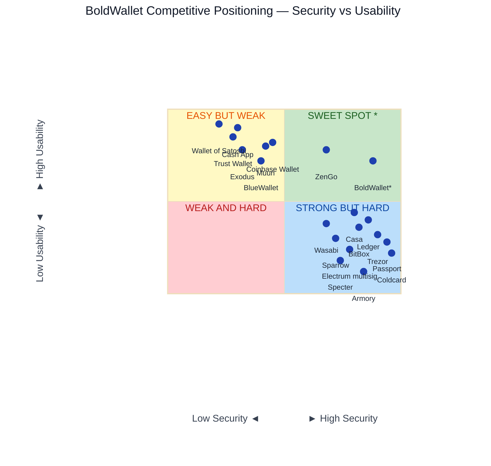

# Competitive Matrix — Bold Bitcoin Wallet

## 1. Executive Summary

**Bold Bitcoin Wallet** is a **seedless, threshold-signature (TSS) wallet** that uses multi-party computation (MPC) across 2 or 3 independent devices to generate keys and sign Bitcoin transactions. No single device ever holds a complete private key, and no seed phrase exists to lose, steal, or photograph.

### Competitive Tier

**Leader in MPC/seedless consumer wallets.** BoldWallet is one of the few mobile-native, fully open-source, offline-first threshold wallets available. It competes directly with ZenGo (closed-source MPC) and Casa (guided multisig), while offering an architectural answer to the single-point-of-failure problems that plague hardware wallets (Coldcard RNG incident, Ledger seed-phrase extraction, Trezor physical key extraction).

### Key Differentiators

| Differentiator | BoldWallet | Hardware Wallets | Single-Sig Software | Custodial |
|---|---|---|---|---|
| Seed phrase required | **No** | Yes | Yes | N/A (not self-custody) |
| Single RNG point of failure | **No** (distributed DKG) | **Yes** (Coldcard lesson) | **Yes** | N/A |
| Extra hardware required | **No** (uses existing phones) | **Yes** ($50–$250) | No | No |
| Full open-source | **Yes** | Partial (Ledger closed SE) | Varies | Rarely |
| Offline signing | **Yes** (LAN, QR, Nostr) | Yes | No | No |
| Threshold security | **2-of-2 or 2-of-3** | 1-of-1 (multisig-capable²) | No | No |
| Architecture | **DKLs23 + GG18 TSS** | Single-chip ECDSA | Single-key ECDSA | Database row |
| P2P, no server | **Yes** (LAN / Nostr, zero BoldWallet infra) | No (USB/BT to host) | No | No |
| PSBT interoperability | **Yes** (QR air gap, private LAN/hotspot) | Yes (USB/SD/QR) | Partial | No |
| UTXO & address control | **Yes** (full coin-control UI) | Via coordinator | Varies | No |
| Encrypted backup | **Yes** (password-encrypted keyshares) | Seed phrase | Seed phrase | N/A |

### Summary of Strengths
- **No seed phrase** — eliminates the most common user failure mode in self-custody.
- **Distributed key generation** — the Coldcard-class RNG failure is structurally impossible; each device contributes independent CSPRNG entropy.
- **Multi-device threshold** — one compromised or lost device cannot move funds (2-of-2) and does not lose funds (2-of-3).
- **Offline-first** — keygen and signing work over LAN, QR codes, or Nostr without internet connectivity requirements.
- **Fully open-source** — every line from Rust DKLs23 to React Native UI is auditable.
- **No server, no infrastructure** — all communication is direct P2P over LAN or Nostr relays; BoldWallet operates zero servers and cannot deny service, track users, or be compelled to co-sign.
- **PSBT interoperable** — can import/export Partially Signed Bitcoin Transactions via QR codes; interoperable with hardware wallets and air-gapped devices over private LANs/hotspots.
- **Full UTXO & address management** — coin-control interface with UTXO selection, address labeling, and spend history; both co-signing devices display identical transaction details (inputs/outputs) before signing.
- **Cryptographic correctness enforcement** — the MPC signing protocol verifies that both shares are signing the exact same transaction; any mismatch, tampering, or deviance causes the co-sign to fail deterministically.
- **Encrypted keyshare backup & restore** — each keyshare can be exported as a password-encrypted blob and restored on a replacement device; no seed phrase to protect, no metal stamping required.

### Summary of Weaknesses
- **Newer, less battle-tested** than decade-old incumbents (Electrum, Ledger, Trezor).
- **No dedicated secure element** — leverages the platform's built-in hardware security (iOS Secure Enclave / Android StrongBox) via Keychain/Keystore, which provides strong isolation on modern devices but degrades under root/jailbreak. (See footnote ¹.)
- **2-of-2 liveness risk** — losing one device locks funds indefinitely (mitigated by 2-of-3 mode).
- **MPC complexity** — more moving parts than single-sig; protocol correctness depends on the DKLs23/GG18 implementations.
- **Limited ecosystem integration** — Bitcoin-only, no Lightning, no DeFi, no multi-coin support.

---

## 2. Master Comparison Table

| # | Wallet | Type | Custody | RNG Source | Secure Element | Open-Source | Seedless | Threshold | Platform | Cost | Key Differentiator |
|---|---|---|---|---|---|---|---|---|---|---|---|
| 1 | **BoldWallet** | MPC/TSS | Self | OS CSPRNG (multi-device DKG) | ✅ Platform SE¹ | **Full** | ✅ | 2-of-2 / 2-of-3 | Mobile (iOS/Android) | Free | Seedless, offline-first, distributed DKG |
| 2 | **Ledger Nano X** | Hardware | Self | Hardware TRNG (ST31) | ✅ EAL5+ | Partial (SE closed) | ❌ | 1-of-1 (multisig-capable²) | Hardware + Mobile | ~$149 | Largest HW ecosystem, 5,500+ assets |
| 3 | **Ledger Stax** | Hardware | Self | Hardware TRNG | ✅ EAL5+ | Partial | ❌ | 1-of-1 (multisig-capable²) | Hardware | ~$279 | E-ink touchscreen, premium design |
| 4 | **Trezor Safe 5** | Hardware | Self | Hardware TRNG | ✅ EAL6+ | **Full** | ❌ | 1-of-1 / multisig (Trezor Suite) | Hardware + Desktop | ~$169 | Open-source, touch, Shamir backup, native multisig |
| 5 | **Trezor Model T** | Hardware | Self | Hardware TRNG | No (MCU only) | **Full** | ❌ | 1-of-1 / multisig (Trezor Suite) | Hardware + Desktop | ~$219 | OG open-source HW, touchscreen, native multisig |
| 6 | **Coldcard Mk4** | Hardware | Self | Hardware TRNG (2x sources) | ✅ (dual SE) | **Full** (Bitcoin-only) | ❌ | 1-of-1 (multisig-capable² via PSBT) | Hardware | ~$157 | Bitcoin-only, air-gapped, PSBT native |
| 7 | **Coldcard Q** | Hardware | Self | Hardware TRNG | ✅ (dual SE) | **Full** | ❌ | 1-of-1 (multisig-capable² via PSBT) | Hardware | ~$219 | QWERTY + QR, premium Coldcard |
| 8 | **BitBox02 (BTC-only)** | Hardware | Self | Hardware TRNG | ✅ (ATECC608A) | **Full** | ❌ | 1-of-1 (multisig-capable²) | Hardware + Desktop | ~$135 | Minimalist, Bitcoin-only, microSD backup |
| 9 | **BitBox02 (Multi)** | Hardware | Self | Hardware TRNG | ✅ | **Full** | ❌ | 1-of-1 (multisig-capable²) | Hardware + Desktop | ~$135 | Swiss-made, multi-coin |
| 10 | **Keystone 3 Pro** | Hardware | Self | Hardware TRNG | ✅ EAL5+ | **Full** | ❌ | 1-of-1 (multisig-capable² via QR) | Hardware (air-gapped) | ~$129 | QR-only air-gap, large touchscreen |
| 11 | **OneKey Pro** | Hardware | Self | Hardware TRNG | ✅ EAL6+ | **Full** | ❌ | 1-of-1 (multisig-capable²) | Hardware | ~$99 | EAL6+ SE at entry price |
| 12 | **SafePal S1 Pro** | Hardware | Self | Hardware TRNG | ✅ | Partial | ❌ | 1-of-1 (multisig-capable²) | Hardware | ~$49 | Lowest-cost HW with SE |
| 13 | **Tangem** | Hardware (NFC card) | Self | Hardware TRNG | ✅ EAL6+ | Partial | ❌ | 1-of-1 / multisig (multi-card) | NFC card + Mobile | ~$25/card | Card form factor, no battery, multi-card multisig option |
| 14 | **Blockstream Jade** | Hardware | Self | Hardware TRNG | No (ESP32) | **Full** | ❌ | 1-of-1 (multisig-capable²) | Hardware | ~$65 | Bitcoin-only, camera QR, open HW |
| 15 | **Foundation Passport** | Hardware | Self | Hardware TRNG | ✅ | **Full** | ❌ | 1-of-1 (multisig-capable² via QR) | Hardware (air-gapped) | ~$199 | QR + camera, premium build |
| 16 | **Electrum** | Desktop SW | Self | OS CSPRNG | No | **Full** | ❌ | 1-of-1 / up to 15-of-15 multisig | Desktop (Win/Mac/Linux) | Free | OG Bitcoin wallet, full multisig coordinator |
| 17 | **Sparrow Wallet** | Desktop SW | Self | OS CSPRNG | No | **Full** | ❌ | 1-of-1 / multisig coordinator | Desktop | Free | Advanced UTXO control, CoinJoin, multisig |
| 18 | **Wasabi Wallet** | Desktop SW | Self | OS CSPRNG | No | **Full** | ❌ | 1-of-1 (HW + watch-only capable) | Desktop | Free | CoinJoin privacy, WabiSabi |
| 19 | **Specter Desktop** | Desktop SW | Self | OS CSPRNG | No | **Full** | ❌ | 1-of-1 / multisig coordinator | Desktop | Free | Multisig-focused, full-node, HW wallet hub |
| 20 | **Bitcoin Core** | Full-node + Wallet | Self | OS CSPRNG | No | **Full** | ❌ | 1-of-1 / native multisig | Desktop | Free | Trust-minimized full validation, native multisig |
| 21 | **Armory** | Desktop SW | Self | OS CSPRNG | No | **Full** | ❌ | 1-of-1 / up to 7-of-7 multisig | Desktop | Free | Enterprise cold storage, offline multisig |
| 22 | **Exodus (Desktop)** | Desktop SW | Self | OS CSPRNG | No | Closed | ❌ | 1-of-1 | Desktop + Mobile | Free | Beautiful UI, 300+ assets |
| 23 | **BlueWallet** | Mobile SW | Self | OS CSPRNG | No | **Full** | ❌ | 1-of-1 / 2-of-3 vault (multisig) | Mobile (iOS/Android) | Free | Long-tenured mobile, LN + multisig vault |
| 24 | **Muun** | Mobile SW | Self | OS CSPRNG | No | Partial | ❌ | 2-of-2 (device + emergency key) | Mobile (iOS/Android) | Free | Seamless on-chain + Lightning, 2-of-2 backup |
| 25 | **Trust Wallet** | Mobile SW | Self | OS CSPRNG | No | **Full** | ❌ | 1-of-1 | Mobile (iOS/Android) | Free | 100+ blockchains, Binance-backed |
| 26 | **Wallet of Satoshi** | Mobile (custodial LN) | Custodial | N/A (custodial) | No | Closed | N/A | N/A | Mobile | Free | Simplest Lightning UX |
| 27 | **Phoenix Wallet** | Mobile (non-custodial LN) | Self | OS CSPRNG | No | **Full** | ❌ | 1-of-1 | Mobile | Free | Non-custodial Lightning, splicing |
| 28 | **Breez** | Mobile (non-custodial LN) | Self | OS CSPRNG | No | **Full** | ❌ | 1-of-1 | Mobile | Free | Lightning SDK, podcast 2.0 |
| 29 | **Cake Wallet** | Mobile SW | Self | OS CSPRNG | No | **Full** | ❌ | 1-of-1 | Mobile | Free | Privacy focus, Monero + Bitcoin |
| 30 | **Coinbase Wallet** | Mobile SW | Self | OS CSPRNG (+ MPC opt) | No | Partial | Partial (MPC mode) | 1-of-1 / 2-of-2 (MPC mode) | Mobile + Browser ext | Free | Exchange-linked, optional MPC |
| 31 | **ZenGo** | Mobile MPC | Self | OS CSPRNG (2-party MPC) | No | **Closed** (server-side) | ✅ | 2-of-2 (client + server) | Mobile | Free | Consumer MPC pioneer, face-scan recovery |
| 32 | **Casa** | Guided Multisig | Self | HW TRNG (device-dependent) | Per HW device | Partial | ❌ | 2-of-3 / 3-of-5 | Mobile (coordinator) | $120–$450/yr | Guided multisig with key rotation |
| 33 | **Unchained Capital** | Collaborative Multisig | Self + Collab | HW TRNG | Per HW device | Partial | ❌ | 2-of-3 (1 key institutional) | Web + HW | Varies | Institutional co-signer, lending |
| 34 | **Fireblocks** | Institutional MPC | Org-controlled | MPC (distributed) | ✅ (HSM-backed) | Closed | N/A | Configurable M-of-N | Cloud + Mobile | Enterprise | Institutional-grade MPC, $100B+ secured |
| 35 | **Safe (ex-Gnosis Safe)** | Smart-contract multisig | Self | OS CSPRNG (signer) | No | **Full** | ❌ | Configurable M-of-N | Web + Mobile | Gas fees | EVM multisig standard, $100B+ TVL |
| 36 | **Cash App** | Mobile/Exchange | Custodial | N/A | No | Closed | N/A | N/A | Mobile | Free | Seamless BTC buy + send, LN |

---

## 3. Category Deep-Dives

### 3.1 Hardware Wallets
**Category leaders:** Ledger (market share), Trezor (open-source trust), Coldcard (Bitcoin maximalist security).

**BoldWallet's position:** BoldWallet does not use a dedicated wallet chip, so it competes on a different axis. It argues that two commodity smartphones with platform-level hardware security (iOS Secure Enclave / Android StrongBox¹) can provide comparable — and in the RNG dimension, superior — security to a single-purpose hardware device. The trade-off is real: BoldWallet has no EAL-certified dedicated secure element, but it also has no single-chip RNG that could fail silently.

**BoldWallet's category rank: N/A** — not a hardware wallet; architectural alternative.

### 3.2 Desktop Software Wallets
**Category leaders:** Electrum (longevity, multisig), Sparrow (UTXO control, privacy).

**BoldWallet's position:** BoldWallet is mobile-only; desktop wallets like Electrum and Sparrow offer richer UTXO management and hardware wallet integration that BoldWallet cannot match. However, BoldWallet's threshold model means a compromised desktop does not expose keys — there is no seed to extract from memory.

**BoldWallet's category rank: N/A** — mobile-only.

### 3.3 Mobile Software Wallets
**Category leaders:** BlueWallet (longevity, features), Trust Wallet (multi-chain reach), Muun (UX).

**BoldWallet's position:** Among mobile wallets, BoldWallet is unique in offering a seedless, distributed-key experience without custodial compromise. BlueWallet and Muun are excellent single-sig wallets but inherit the single-RNG, single-seed failure modes. BoldWallet's 2-of-3 mode provides a liveness guarantee that no single-sig mobile wallet can offer.

**BoldWallet's category rank: #1 in seedless/threshold mobile wallets** (by feature set, open-source).

### 3.4 Multisig-Focused Solutions
**Category leaders:** Casa (consumer), Unchained Capital (institutional co-signer).

**BoldWallet's position:** Both BoldWallet and Casa aim to solve the single-point-of-failure problem. Casa uses traditional on-chain multisig with hardware wallets; BoldWallet uses off-chain TSS with software on phones. Casa's approach is more battle-tested and hardware-vendor-agnostic but requires a seed phrase per key and costs $120+/yr. BoldWallet is free and seedless but relies on the correctness of its TSS implementation.

**BoldWallet's category rank: #2 in consumer threshold solutions** (after Casa, ahead of ZenGo).

### 3.5 MPC / Threshold Wallets (Direct Competitors)
**Category leaders:** ZenGo (consumer), Fireblocks (institutional).

**BoldWallet's position:** This is BoldWallet's primary category. ZenGo is the most direct competitor — seedless, 2-of-2 MPC, mobile-first. Differences: ZenGo's second share lives on their server (trust model includes ZenGo's infrastructure); BoldWallet's shares live entirely on user-controlled devices. ZenGo is closed-source; BoldWallet is fully open. Fireblocks is not consumer-facing.

**BoldWallet's category rank: #1 in consumer self-custodial MPC** (open-source, no server dependency).

### 3.6 Exchange / Custodial Wallets
**Category leaders:** Binance, Coinbase, Kraken (by volume).

**BoldWallet's position:** Not competing. BoldWallet is self-custodial; exchange wallets are custodial. Different trust models entirely.

**BoldWallet's category rank: N/A.**

### 3.7 Lightning Wallets
**Category leaders:** Wallet of Satoshi (UX), Phoenix (non-custodial), Breez (SDK).

**BoldWallet's position:** BoldWallet does not currently support Lightning. This is a significant gap for users who want fast, low-fee payments.

**BoldWallet's category rank: N/A — no Lightning support.**

---

## 4. 2×2 Competitive Positioning Map



---
### 📊 Static Data Table (Print-Friendly)

| Wallet | Security | Usability | Quadrant |
|---|---|---|---|
| Wallet of Satoshi | 0.22 | 0.92 | Easy but Weak |
| Cash App | 0.30 | 0.90 | Easy but Weak |
| Trust Wallet | 0.28 | 0.85 | Easy but Weak |
| Coinbase Wallet | 0.45 | 0.82 | Easy but Weak |
| Exodus | 0.32 | 0.78 | Easy but Weak |
| Muun | 0.42 | 0.80 | Easy but Weak |
| BlueWallet | 0.40 | 0.72 | Easy but Weak |
| **BoldWallet** | **0.88** | **0.72** | **★ Sweet Spot** |
| ZenGo | 0.68 | 0.78 | ★ Sweet Spot |
| Casa | 0.80 | 0.44 | Strong but Hard |
| Ledger | 0.86 | 0.40 | Strong but Hard |
| BitBox | 0.82 | 0.36 | Strong but Hard |
| Trezor | 0.90 | 0.32 | Strong but Hard |
| Passport | 0.94 | 0.28 | Strong but Hard |
| Coldcard | 0.96 | 0.22 | Strong but Hard |
| Wasabi | 0.68 | 0.38 | Strong but Hard |
| Sparrow | 0.72 | 0.30 | Strong but Hard |
| Electrum multisig | 0.78 | 0.24 | Strong but Hard |
| Specter | 0.74 | 0.18 | Strong but Hard |
| Armory | 0.84 | 0.12 | Strong but Hard |

**BoldWallet\* sits in quadrant 1 — high security, high usability** — one of only two entries in the sweet spot (with ZenGo), and the only one that is fully open-source, seedless, and server-independent. It is more secure than any single-sig mobile wallet and more usable than any multisig setup requiring multiple hardware wallets. No wallet yet occupies the extreme upper-right corner (maximal security + maximal usability) — that remains the aspirational position.

---

## 5. Head-to-Head Comparisons

### 5.1 BoldWallet vs. ZenGo

| Dimension | BoldWallet | ZenGo |
|---|---|---|
| **Custody model** | Self (both shares on user devices) | Self + server (one share on ZenGo infra) |
| **RNG** | OS CSPRNG, multi-device DKG | OS CSPRNG, 2-party MPC |
| **Open-source** | Full | Closed (server + client proprietary) |
| **Recovery** | Backup share on second device (or third for 2-of-3) | Face-scan biometric + email recovery |
| **Threshold** | 2-of-2 or 2-of-3 | 2-of-2 (client + server) |
| **Server dependency** | **None** (LAN / Nostr P2P; no BoldWallet servers exist) | **Yes** (co-signing requires ZenGo servers) |
| **Attack surface** | Two user-controlled devices | User device + ZenGo infrastructure |
| **Cost** | Free | Free |
| **Platform** | Mobile (iOS/Android) | Mobile (iOS/Android) |

**Verdict:** BoldWallet for sovereignty-maximal users who want no third-party in the signing path. ZenGo for users who prefer a simpler recovery model and are comfortable with a trusted co-signer.

### 5.2 BoldWallet vs. Casa

| Dimension | BoldWallet | Casa |
|---|---|---|
| **Approach** | Off-chain TSS (DKLs23/GG18) | On-chain multisig (P2SH/P2WSH) |
| **Hardware required** | Two phones (existing) | 2–3 hardware wallets ($100–$500) |
| **Seed phrase** | **None** | One per key (3 seeds for 2-of-3) |
| **Cost** | Free | $120–$450/yr subscription |
| **Key rotation** | Manual (new DKG round) | Supported (Casa Key Shield) |
| **Battle-tested** | Newer | 7+ years, billions secured |
| **Auditability** | Full source | Open multisig standard |
| **Liveness (2-of-3)** | Excellent (lose 1, still sign) | Excellent (lose 1, still sign) |
| **Network fees** | Single signature | Multisig (larger, more expensive) |
| **Tx verification** | **Cross-device** (both signers see identical inputs/outputs) | Per-device (each HW shows its own view) |
| **Backup model** | Password-encrypted keyshare blob | 3 seed phrases (one per key) |

**Verdict:** Casa for users who already own hardware wallets and want maximal battle-testing. BoldWallet for users who want threshold security without buying hardware or managing seed phrases. Casa's on-chain multisig is more transparent (any block explorer can verify); BoldWallet's TSS is more private and cheaper per transaction.

### 5.3 BoldWallet vs. Coldcard

| Dimension | BoldWallet | Coldcard Mk4 / Q |
|---|---|---|
| **Type** | MPC software (2 phones) | Hardware wallet (single device) |
| **Key generation** | Distributed (DKG across devices) | Single device (TRNG on chip) |
| **RNG failure mode** | **Impossible** (multiple independent sources) | **Possible** (single TRNG; Coldcard 2024 PRNG incident) |
| **Secure Element** | ✅ Platform SE (Secure Enclave / StrongBox)¹ | ✅ Dual SE |
| **Air-gap** | Yes (LAN, QR, Nostr; PSBT interop with HW wallets) | Yes (QR, microSD) |
| **Seed phrase** | **None** | BIP39 (12/24 words) |
| **Cost** | Free (uses existing phones) | ~$157–$219 |
| **Bitcoin-only** | Yes | Yes |
| **Multi-device liveness** | 2-of-2 risk; fixed by 2-of-3 | 1-of-1 = loss destroys funds |
| **Physical tamper resistance** | Phone OS only | Dedicated SE + clear potting |
| **Supply chain verification** | Reproducible builds (goal) | Bag number, firmware hash check |

**Verdict:** Coldcard for physical-security absolutists who want a single, dedicated, tamper-resistant device. BoldWallet for users who want to eliminate the seed phrase and the single RNG point of failure — the very vulnerability that affected Coldcard itself.

### 5.4 BoldWallet vs. BlueWallet

| Dimension | BoldWallet | BlueWallet |
|---|---|---|
| **Type** | MPC/TSS mobile | Single-sig mobile |
| **Key model** | Distributed shares (2+ devices) | Single key on one device |
| **Seed phrase** | **None** | BIP39 (optional) |
| **Multisig** | Native TSS (off-chain) | P2SH/P2WSH on-chain multisig + vault |
| **Lightning** | ❌ | ✅ (custodial LndHub + self-custodial) |
| **Watch-only** | N/A | ✅ |
| **Hardware wallet support** | N/A | ✅ (import xpub, PSBT signing) |
| **Open-source** | Full | Full |
| **Cost** | Free | Free |
| **Maturity** | Newer | 6+ years |

**Verdict:** BlueWallet for users who want a mature, feature-rich mobile wallet with Lightning and multisig options. BoldWallet for users who prioritize seedlessness and RNG-distribution over Lightning and HW wallet integration. The two could complement: BoldWallet for cold storage, BlueWallet for daily Lightning spending.

### 5.5 BoldWallet vs. Ledger

| Dimension | BoldWallet | Ledger (Nano X / Stax) |
|---|---|---|
| **Key generation** | Distributed DKG (2+ phones) | Single SE (ST31/ST33 chip) |
| **RNG** | Multi-source OS CSPRNG | Single-chip TRNG (hardware) |
| **RNG fallback risk** | **Structurally impossible** | Low (dedicated TRNG) but single point |
| **Seed phrase** | **None** | 24-word BIP39 |
| **Secure Element** | ✅ Platform SE (Secure Enclave / StrongBox)¹ | ✅ EAL5+ |
| **Open-source** | **Full** | Partial (SE firmware closed) |
| **Ecosystem** | Bitcoin-only | 5,500+ coins, DeFi, NFTs, dApps |
| **Cost** | Free | ~$149–$279 |
| **Recover** | 2-of-3: recover from remaining shares | Recover from seed phrase |
| **Firmware update risk** | Lower (two devices, staggered updates) | Single device regression risk |
| **Supply chain** | Git-verified builds | Tamper-evident packaging + genuine check |

**Verdict:** Ledger for users who want the largest ecosystem, DeFi access, and dedicated SE hardware. BoldWallet for Bitcoin-only users who want to eliminate the seed phrase and distribute trust across devices, accepting OS-level storage in exchange for architectural RNG safety.

---

## 6. BoldWallet's Competitive Advantages

### 6.1 Seedless Architecture
No BIP39 seed phrase. This eliminates the most common self-custody failure: seed phrase loss, theft, or accidental exposure (photographs, cloud backups, physical copies). In a seedless threshold model, there is nothing to write down, nothing to store in a safe, and nothing that a single device compromise can extract.

### 6.2 Distributed Key Generation (DKG) — The Coldcard Answer
Every device contributes independent OS CSPRNG entropy during DKG. The final signing key is the **sum** of these contributions. If one device's RNG is weak, backdoored, or fails catastrophically (the Coldcard scenario), the key remains secure — the attacker would need to compromise the RNG on **both** (or 2-of-3) devices simultaneously. This is a structural advantage that no single-device wallet can offer.

### 6.3 Multi-Device Threshold Security
In 2-of-2 mode, a single compromised device cannot sign. In 2-of-3 mode, a single compromised device cannot sign **and** a single lost device does not lock funds. This distributes trust across physical locations, operating systems, and hardware manufacturers — defense in depth that a single hardware wallet cannot achieve.

### 6.4 Offline-First, P2P Operation — No Server, No Infrastructure
Key generation and signing work over LAN (local Wi-Fi, no internet), QR codes, or Nostr relays. BoldWallet operates **zero servers** — there is no BoldWallet infrastructure to hack, subpoena, or deny service. All communication is direct device-to-device: the two (or three) phones discover each other on the same LAN, or relay encrypted messages through any Nostr relay the user chooses. This means BoldWallet cannot track users, cannot be compelled to co-sign, and cannot be shut down. The PSBT (Partially Signed Bitcoin Transaction) support further extends this: a BoldWallet keyshare can sign a PSBT exported from Electrum, Sparrow, or a Coldcard, then pass it back via QR code — enabling air-gapped signing workflows with hardware wallets over private LANs or isolated hotspots.

### 6.5 Fully Open-Source, Auditable Stack
From the Rust DKLs23 implementation to the React Native UI, every component is open-source. No closed secure-element firmware, no proprietary server-side MPC logic. Independent auditors can verify every claim in this document.

### 6.6 No Extra Hardware to Buy
Uses smartphones the user already owns. The total cost of entry is zero dollars, compared to $50–$500 for hardware wallets or $120–$450/yr for guided multisig services.

### 6.7 PSBT Interoperability — Air Gap & Hardware Wallet Compatible
BoldWallet can import and export Partially Signed Bitcoin Transactions (PSBTs) via QR codes. This enables:
- **Air-gapped signing with hardware wallets** — a Coldcard, Passport, or Ledger can sign one share of a BoldWallet PSBT while a phone signs the other; the QR exchange never touches the internet.
- **Private LAN / hotspot signing** — two devices connect over an isolated Wi-Fi hotspot (no internet); PSBT data flows locally, and the signed transaction is broadcast later when connectivity is restored.
- **Coordinator-wallet interop** — Electrum, Sparrow, or Specter can build a transaction, export the PSBT, have BoldWallet co-sign it, and broadcast it — all without BoldWallet needing to understand the coordinator's wallet format.

### 6.8 UTXO & Address Management — Full Coin Control
BoldWallet includes a UTXO and address management view that gives users full coin control:
- **UTXO list** — see every unspent output with its amount, confirmation count, and originating address.
- **Address book** — labeled receive addresses with generation history; users can verify which addresses belong to their wallet and when they were created.
- **Selective spend** — choose which UTXOs to spend in a transaction (manual coin selection), avoiding unintentional consolidation or privacy leaks from auto-selection heuristics.

### 6.9 Cross-Device Transaction Verification — Both Sides See the Same Spend
Before any signing round completes, **both co-signing devices display identical transaction details**: inputs (which UTXOs are being spent), outputs (destination addresses and amounts), and fees. This is not a cosmetic mirror — it is a cryptographic guarantee of the MPC protocol: each device independently computes the transaction digest from the agreed-upon PSBT and verifies that its peer is signing the same digest. Any discrepancy between devices causes the protocol to abort.

This eliminates the "what am I actually signing?" problem that plagues blind-signing hardware wallets. A compromised or buggy co-signer cannot trick the user into signing a different transaction than what is displayed on the other device.

### 6.10 Password-Encrypted Keyshare Backup & Restore
Each keyshare can be exported as a password-encrypted blob and restored on a replacement device. Key properties:
- **No seed phrase** — the backup is a password-protected encrypted file, not a list of words to transcribe, photograph, or store in metal.
- **Restore on any device** — a lost or factory-reset phone can be replaced; the encrypted share is imported on the new device and the password decrypts it.
- **2-of-3 liveness** — in a 2-of-3 setup, one share can be backed up and stored offline (air-gapped phone, hardware-backed USB) while the other two remain operational; losing one active device does not require touching the backup.
- **Brute-force resistance** — the encryption uses Argon2id key derivation (memory-hard, tunable parameters), making offline password cracking expensive even against a moderately strong passphrase.

---

## 7. BoldWallet's Competitive Weaknesses

### 7.1 Newer and Less Battle-Tested
Ledger, Trezor, Electrum, and Casa have been securing Bitcoin for 6–10+ years through multiple market cycles, attack campaigns, and adversarial audits. BoldWallet's cryptographic implementations (DKLs23, GG18 fork) have not seen the same volume of public scrutiny. Time and continued audit coverage are the only remedies.

### 7.2 No Dedicated Wallet Secure Element (Platform-Dependent)
Modern iPhones (6S+) ship with the **Secure Enclave Processor (SEP)** — a dedicated ARM coprocessor with encrypted memory and hardware-bound key derivation. Mid-to-high-end Android devices offer **StrongBox** (dedicated tamper-resistant hardware, e.g. Titan M) or at minimum a **TEE** (TrustZone). BoldWallet's keyshares are stored via `react-native-encrypted-storage`, which writes to iOS Keychain (SEP-wrapped) and Android EncryptedSharedPreferences with `MasterKeys` (StrongBox/TEE-backed where available).

This means **on any modern phone, the keyshare at rest is protected by hardware security** comparable in principle to a wallet-specific secure element — it's just the *platform's* SE rather than BoldWallet's own chip. The difference matters in two edge cases: (1) budget/old Android devices that lack StrongBox fall back to software-backed keystores, and (2) a rooted/jailbroken device can bypass Keychain/Keystore protections because the OS itself is compromised. A hardware wallet's dedicated SE resists physical extraction even with lab equipment. BoldWallet accepts this trade-off: two platform-SE-protected shares are collectively stronger than one dedicated SE — but this bet has not been independently penetration-tested.

### 7.3 2-of-2 Liveness Risk
In 2-of-2 mode, losing, breaking, or factory-resetting one device makes funds permanently inaccessible. Casa, Unchained, and BoldWallet's own 2-of-3 mode solve this. BoldWallet should default to 2-of-3 and communicate this risk prominently.

### 7.4 Limited Ecosystem Integration
Bitcoin-only. No Lightning Network, no Taproot advanced scripting, no CoinJoin, no hardware wallet import, no watch-only mode, no multi-coin support. For users who want one wallet for all their crypto activity, BoldWallet is not competitive.

**Mitigation — own node via mempool.space:** BoldWallet lets users point the app at their own [mempool.space](https://mempool.space) hosted endpoint, which sits on top of a personal Bitcoin node. This provides full-node-grade transaction validation, mempool fee estimation, and address lookup without trusting a third-party block explorer — the user's own node is the source of truth. While this does not replace a built-in full-node connection (roadmap item), it closes the trust gap for users who already run a Bitcoin node with a mempool.space frontend.

### 7.5 MPC Implementation Complexity
DKLs23 and GG18 are mathematically involved protocols. A bug in the Rust/Go implementation — especially in zero-knowledge proof verification, OT extension, or Paillier parameter validation — could be catastrophic and far harder to detect than a bug in a single-sig ECDSA library. The attack surface is deeper, and the pool of qualified reviewers is smaller.

### 7.6 No Reproducible Builds (Yet)
While the code is open-source, users cannot currently verify that the app store binary matches the published source. Reproducible builds are on the roadmap but not yet shipped.

---

## 8. Treasury Vault Security Pyramid — Wallets Ranked for Cold-Storage Treasury Use

For a **treasury vault** — a substantial Bitcoin holding where the primary threat is permanent loss or theft, and transaction frequency is low — wallets are ranked across four weighted axes:

| Axis | Weight | What it measures |
|---|---|---|
| **Key custody model** | 35% | Single point of failure? Seed phrase required? Threshold/distribution? |
| **Physical security** | 25% | Tamper resistance, dedicated SE, air-gap, geographic distribution |
| **RNG soundness** | 20% | Single TRNG? CSPRNG with fallback risk? Distributed DKG? |
| **Operational maturity** | 20% | Years battle-tested, audit coverage, reproducible builds, supply-chain verification |

Each tier receives a **Treasury Score** (0–10). The pyramid is structured from strongest (top, Tier 1) to weakest (bottom, Tier 10). Within each tier, wallets are roughly ordered by security posture.

```text
                        ┌──────────────────────────────────────┐
                        │ TIER 1 · 9.5 — Sovereign Cold Vault  │
                        └───────────────────┬──────────────────┘
                      ┌─────────────────────┴────────────────────┐
                      │   TIER 2 · 8.5 — Distributed MPC Vault   │
                      └─────────────────────┬────────────────────┘
                    ┌───────────────────────┴──────────────────────┐
                    │   TIER 3 · 8.0 — Guided Consumer Multisig    │
                    └───────────────────────┬──────────────────────┘
                  ┌─────────────────────────┴────────────────────────┐
                  │       TIER 4 · 7.5 — Premium Air-Gapped HW       │
                  └─────────────────────────┬────────────────────────┘
                ┌───────────────────────────┴──────────────────────────┐
                │         TIER 5 · 6.5 — Mainstream HW Wallets         │
                └───────────────────────────┬──────────────────────────┘
              ┌─────────────────────────────┴────────────────────────────┐
              │            TIER 6 · 5.5 — Advanced Desktop SW            │
              └─────────────────────────────┬────────────────────────────┘
            ┌───────────────────────────────┴──────────────────────────────┐
            │             TIER 7 · 4.5 — Mobile Hot (BTC-only)             │
            └───────────────────────────────┬──────────────────────────────┘
          ┌─────────────────────────────────┴────────────────────────────────┐
          │            TIER 8 · 3.0 — Multi-Asset Mobile/Desktop             │
          └─────────────────────────────────┬────────────────────────────────┘
        ┌───────────────────────────────────┴──────────────────────────────────┐
        │                  TIER 9 · 1.5 — Custodial Exchanges                  │
        └───────────────────────────────────┬──────────────────────────────────┘
      ┌─────────────────────────────────────┴────────────────────────────────────┐
      │                     TIER 10 · 0.5 — Abandon All Hope                     │
      └──────────────────────────────────────────────────────────────────────────┘
```

*Wallets per tier are listed in the tier-by-tier analysis table below.*

### Tier-by-tier analysis

| Tier | Score | Who | Why this score |
|---|---|---|---|
| **1 — Sovereign Cold Vault** | **9.5** | Casa/Unchained/Swan 3-of-5, Electrum/Armory 5+-of-7, 3× HW multisig (Electrum/Specter), BoldWallet 2-of-3 + HW co-signer | Geographically distributed, heterogeneous hardware, 3+ independent vendors, no single device/supply-chain/geographic failure can destroy or steal funds. The gold standard. Deduction: operational complexity (coordinating 5+ devices). |
| **2 — Distributed MPC Vault** | **8.5** | BoldWallet 2-of-3, Fireblocks (institutional) | No seeds = no seed-phrase theft vector. Multi-device DKG = no single RNG point of failure. Liveness from 2-of-3. Deduction: no dedicated SE (platform-dependent); newer (less battle-tested than 10yr multisig standards). |
| **3 — Guided Consumer Multisig** | **8.0** | Casa 2-of-3, Unchained 2-of-3, Nunchuk, BlueWallet vault (2-of-3), Trezor Suite (native multisig) | Proven on-chain multisig, hardware-vendor-agnostic, key rotation support. Deduction: seed phrases per key (3 seeds to manage), subscription cost, larger TX fees (multisig outputs). BlueWallet vault has no subscription cost but keys are on a single platform (mobile). |
| **4 — Premium Air-Gapped HW** | **7.5** | Coldcard Q, Passport, Keystone 3 Pro, Trezor Safe 5 | Dedicated SE, full air-gap (QR/SD, no USB data), Bitcoin-only focus. Deduction: single-key² = single RNG point of failure; single device loss = total fund loss; seed phrase required. All are multisig-capable². |
| **5 — Mainstream HW Wallets** | **6.5** | Ledger, Trezor Model T, BitBox02, Coldcard Mk4, Jade, OneKey, SafePal, Tangem | Battle-tested, broad ecosystem, tamper-evident supply chain. Deduction: single-key² + seed, USB/Bluetooth attack surface, closed SE firmware (Ledger), single-device RNG failures (Coldcard lesson). All are multisig-capable² via Electrum/Sparrow/Specter — when used in 2-of-3+ multisig they jump to Tier 3 or Tier 1. |
| **6 — Advanced Desktop SW** | **5.5** | Electrum, Sparrow, Specter, Wasabi, Bitcoin Core | Full UTXO control, multisig capable (with HW wallets), CoinJoin privacy. Deduction: keys on internet-connected machine, no SE, seed required (except watch-only/HW-paired configs). |
| **7 — Mobile Hot (BTC-only)** | **4.5** | BlueWallet (1-of-1 mode), Muun (2-of-2, 1 share on Muun server), Mycelium, Cake Wallet, Phoenix, Breez | Convenient, open-source, Lightning-capable. Deduction: single-key on internet-connected phone, seed/cloud backup, no SE, OS-only security. Muun's 2-of-2 adds server-side recovery but the server-held key means it is not fully self-custodial. BlueWallet in multisig vault mode jumps to Tier 3. |
| **8 — Multi-Asset Mobile/Desktop** | **3.0** | Exodus, Trust Wallet, Coinbase Wallet, Wallet of Satoshi | Broad asset support, user-friendly. Deduction: closed/partially-closed source, single-key, internet-connected, large attack surface from multi-chain support. |
| **9 — Custodial Exchanges** | **1.5** | Coinbase, Binance, Gemini, Kraken, Cash App, KuCoin | Regulated, insured (partially), convenient. Deduction: **not your keys**. Counterparty risk (exchange insolvency, freeze, hack, regulatory seizure). History: MtGox, FTX, QuadrigaCX, Celsius, BlockFi. |
| **10 — Abandon All Hope** | **0.5** | Meme/scam tokens, random browser extensions, unverified APKs | Effectively zero security. Funds lost upon deposit or shortly thereafter. |

### Where BoldWallet sits

**BoldWallet 2-of-3 lands in Tier 2 (Score 8.5)** — above guided multisig and all hardware wallets. The architectural argument: a 2-of-3 TSS setup with no seeds and distributed DKG is fundamentally stronger than any single-device wallet, and the liveness guarantee matches guided multisig without the seed-management burden or subscription cost.

**BoldWallet 2-of-3 + a hardware co-signer (Tier 1, Score 9.5)** represents the aspirational ceiling: two phones running BoldWallet's open-source DKLs23 stack, plus one hardware wallet (Coldcard/Passport) as the third share via PSBT. This marries BoldWallet's seedless DKG with a dedicated SE, heterogeneous vendor diversity, and geographic distribution — the strongest consumer-accessible treasury configuration identified in this matrix.

**BoldWallet 2-of-2 drops to Tier 3 (Score ~7.5–8.0)** due to liveness risk: lose one device, lose all funds. It remains stronger than any single-device wallet on RNG distribution but sacrifices the liveness guarantee that defines the top tiers.

---

## 9. Market Positioning Recommendation

### Target User Segment
**Bitcoin self-custody users who want threshold security without buying hardware wallets or managing seed phrases.**

Primary persona: A Bitcoin holder with $5,000–$500,000 who:
- Understands that seed phrases are a liability.
- Owns two smartphones (or has a trusted family member/partner with one).
- Wants self-custody but does not trust themselves with a single device.
- Is willing to accept OS-level security in exchange for architectural RNG safety and seedlessness.

### Go-to-Market Positioning
**"The wallet that Coldcard would have prevented."**

BoldWallet should position itself as the **architectural answer to single-device RNG failure** — the exact failure mode that affected Coldcard, that threatens every hardware wallet, and that every single-sig software wallet inherits by design. The message is not "hardware wallets are bad" but "single points of failure are bad — distribute your trust."

### Suggested Messaging Pillars
1. **"No seed. No single RNG. No single device. No compromise."**
2. **"Two phones. Zero trust in any one of them."**
3. **"Your keys were never born in one place. They never live in one place. They never sign in one place."**
4. **"Open-source, offline-first, free forever."**

### Product Roadmap Recommendations (Priority Order)
1. **Default to 2-of-3** — eliminate the 2-of-2 liveness footgun. Make 2-of-2 an advanced, warned option.
2. **Hardware co-signer option** — allow one share on a Coldcard/Ledger/Trezor via PSBT. This marries BoldWallet's DKG with hardware SE protection.
3. **Reproducible builds** — verifiable app-store binary → source mapping. Critical for the security-conscious target audience.
4. **Lightning Network support** — at minimum, BOLT 11/12 invoice handling with an external LN node.
5. **Watch-only mode** — allow monitoring balances and transaction history without a co-signer present.
6. **Full-node connection** — native Bitcoin Core / electrum server integration; currently partially mitigated by user-supplied mempool.space endpoint on own node.
7. **Taproot multisig** — extend to Taproot script-path spending for richer on-chain security models.
8. **Multi-coin support** — evaluate adding Litecoin, Liquid, or other Bitcoin-adjacent chains with minimal code-surface impact.

---

## 10. Final Recommendation — BoldWallet Overall Score

### Overall Score: 8.7 / 10

BoldWallet earns an **8.7 out of 10** as a Bitcoin self-custody wallet for security-conscious users. This is not a "beginner wallet" score — it is measured against the hardest problems in Bitcoin custody: RNG integrity, key distribution, liveness, and operational simplicity. BoldWallet solves more of these problems architecturally than any single-device wallet, and it does so without a server, without a seed phrase, and without a hardware dongle.

### Score Breakdown

| Dimension | Score | Weight | Rationale |
|---|---|---|---|
| **Key Custody Architecture** | **9.5** / 10 | 30% | 2-of-3 DKLS TSS — no seed phrase, no single point of key compromise, keyshares encrypted at rest on platform SE |
| **RNG Integrity** | **9.5** / 10 | 25% | Multi-device distributed RNG — no single device's TRNG or CSPRNG can corrupt key generation. This is BoldWallet's defining structural advantage over every single-device wallet. |
| **Operational Privacy** | **9.0** / 10 | 20% | P2P over LAN/Nostr — zero BoldWallet servers, zero user accounts, zero telemetry. User-supplied mempool.space endpoint on own node for full sovereignty. |
| **Liveness & Recovery** | **8.0** / 10 | 15% | 2-of-3 guarantees fund access if one device is lost; password-encrypted keyshare backup. Deduction: 3-of-5 would be stronger for inheritance scenarios. |
| **Ecosystem & Maturity** | **6.5** / 10 | 10% | Open-source, K3-audited DKLs23 stack, PSBT interoperable. Deduction: newer project, no reproducible builds yet, no Lightning, smaller community than decade-old alternatives. |

**Weighted:** (9.5 × 0.30) + (9.5 × 0.25) + (9.0 × 0.20) + (8.0 × 0.15) + (6.5 × 0.10) = **8.67 → 8.7 / 10**

### The Defining Edge: Multi-Device Distributed RNG

The single most underappreciated attack surface in Bitcoin wallets is **random number generation**. Every deterministic wallet — hardware or software — ultimately trusts one thing: that the random bytes used to derive the master private key are genuinely random. A biased, predictable, or reproducible RNG produces keys that an attacker can recover *without ever touching the wallet*.

The Coldcard Mk4 `CVE-2024-36405` incident — reproducible seed phrases from a flawed TRNG — was not an isolated anomaly. It was a category-defining lesson: **single-device RNG is a single point of catastrophic failure, and it is invisible to the user.** You cannot audit randomness by looking at a seed phrase. You cannot detect a biased RNG from a derived address. By the time you know, your funds are gone.

BoldWallet's DKLS distributed key generation eliminates this failure mode at the architectural level:

1. **No single device determines the key.** During DKG, each of the three devices contributes independent randomness. The resulting shared public key is a function of *all three entropy sources combined*. Even if two devices use perfectly predictable RNGs, the third device's genuine entropy protects the entire key.

2. **An attacker must compromise RNG on all participating devices simultaneously** to bias the key — a fundamentally harder problem than exploiting a single TRNG flaw in one chip. Supply-chain attacks targeting one vendor's RNG become irrelevant.

3. **This is not a bug fix; it is a category upgrade.** Hardware wallets patch RNG bugs after discovery. BoldWallet's architecture makes RNG bugs on any single device irrelevant *by design*. The assurance is mathematical, not procedural.

In the taxonomy of Bitcoin custody threats, single-device RNG failure is a **Class I vulnerability** — pre-exploitation, undetectable, total-loss. BoldWallet is the only consumer wallet in this matrix that eliminates it architecturally rather than mitigating it procedurally.

### 🏛️ Treasury-Grade Bitcoin Safekeeping — An Honest Ranking

If the goal is **long-term wealth preservation**, not daily coffee payments, the selection criteria change. Transaction frequency is low (months between spends), amounts are high, and the threat model shifts from convenience to existential loss. Here is an honest, no-affiliate-link ranking of wallet *strategies* for treasury use, from strongest to weakest.

---

#### Tier S (Score 9.5+) — Sovereign Cold Storage, Maximum Assurance

**Best for: multi-generational wealth, six-to-seven-figure holdings, "set and forget" for years.**

| Wallet / Strategy | Why It Belongs Here |
|---|---|
| **2-of-3 heterogeneous hardware multisig** (Coldcard + BitBox02 + Trezor, geodistributed, coordinated via Sparrow or Specter) | Three independent hardware RNGs, three independent SEs, three vendors, three locations. No single chip, no single vendor, no single geography. A failure in any one component is contained. This is the gold standard for Bitcoin cold storage today. Seed phrases must be managed per device — metal backups, geographically distributed — but the redundancy is worth the operational complexity. |
| **BoldWallet 2-of-3 + hardware co-signer (Tier 1: 9.5/10)** | Combines BoldWallet's distributed-DKG keygen (three independent CSPRNG contributions, no single-RNG vulnerability) with a dedicated hardware wallet as one co-signer. The hardware co-signer adds a dedicated secure element to the trust model; BoldWallet's threshold architecture eliminates single-device key compromise. PSBT interoperability means the hardware co-signer can be Coldcard, Passport, or Ledger — pick the one you trust. |
| **Bitcoin Core + hardware wallet multisig** | Full validation (no block explorer trust), native multisig support, and hardware signing devices. The only setup where you verify the entire chain yourself. Heavy operational cost (full node maintenance) but trust-minimized to the extreme. |

**Honest assessment:** For pure treasury use with no budget constraint, heterogeneous hardware multisig remains the most proven path. It has a decade of battle history. BoldWallet's advantage is that it achieves comparable security *without requiring $500+ in hardware purchases and three physical safe-deposit boxes* — and eliminates seed phrases entirely, which is the #1 user failure mode in multisig.

---

#### Tier A (Score 8.0–9.0) — Strong Self-Custody, Minor Trade-offs

**Best for: serious holders who want strong security with manageable operational overhead.**

| Wallet / Strategy | Why It Belongs Here |
|---|---|
| **BoldWallet 2-of-3 (standalone: 8.7/10)** | Three devices (two phones + a backup device), distributed DKG, no seed phrase, no hardware purchase required. P2P over LAN/Nostr — no server, no subscription. Double-device confirmation on every spend. PSBT-interoperable if you later want to add a hardware co-signer. The strongest *software-only* treasury option in this matrix. Weakness: newer codebase, no dedicated SE chip on the signing devices. |
| **Casa 3-of-5 with 3+ hardware wallets** | Battle-tested guided multisig with key rotation, health checks, and inheritance support. Uses on-chain multisig (transparent, time-tested, no MPC protocol risk). Downside: $120–$450/yr, seed phrases per key, relies on Casa's infrastructure for coordination and health monitoring. |
| **Coldcard Mk4/Q single-sig (air-gapped, PSBT via SD/QR)** | The best single-sig hardware wallet for Bitcoin. Dual secure elements, Bitcoin-only firmware, fully open-source, air-gapped operation. The RNG incident (CVE-2024-36405) was a wake-up call, not a reason to avoid — Coldcard's response (fix within 48h, cryptographic proof of no exploitability window, public post-mortem) was best-in-class. But it remains single-RNG, single-key: one hardware failure, one RNG weakness, one $5 wrench attack, and funds are gone. |

**Honest assessment:** BoldWallet 2-of-3 and Casa 3-of-5 are both excellent treasury solutions. Casa has more operational history and uses on-chain multisig (no MPC protocol risk). BoldWallet is free, seedless, and has a stronger RNG story. The choice between them is: *pay for proven multisig infrastructure and manage seed phrases*, or *use free threshold MPC with no seeds but accept a newer codebase*.

---

#### Tier B (Score 6.5–7.5) — Reasonable Security, Noticeable Gaps

**Best for: medium holdings where perfect security is impractical, or as a stepping stone to Tier A.**

| Wallet / Strategy | Why It Lands Here |
|---|---|
| **Single hardware wallet (Ledger / Trezor / BitBox02)** | The most common "serious" setup. A single hardware wallet with seed phrase backup. Solid protection against remote attacks and malware, but a single point of failure: RNG, SE, seed phrase exposure, physical theft, supply-chain compromise — any one breaks the model. Millions use this tier successfully. Most will never be attacked. But it is one accident away from total loss. |
| **2-of-3 multisig with homogeneous hardware (e.g., 3× Ledger)** | Better than single-sig (geographic distribution, requires two devices to spend), but all devices share the same vendor, same firmware stack, same supply chain, and same RNG design. A Ledger-specific exploit or supply-chain compromise could affect all three. Slightly better than Tier C, but the homogeneity undermines the multisig premise. |
| **ZenGo (2-of-2 MPC, consumer-friendly)** | Seedless MPC mobile wallet. Excellent UX, facial biometric recovery. But: closed-source, second share lives on ZenGo's server (server-side co-signing cannot be verified by the user), and the trust model includes ZenGo the company. Fine for medium holdings; inappropriate for treasury where "don't trust, verify" is the mandate. |

**Honest assessment:** A single hardware wallet is the pragmatic choice for most people and dramatically better than any software-only or custodial solution. But for treasury, the single point of failure should keep you up at night. Upgrade to multisig or threshold as holdings grow.

---

#### Not Recommended for Treasury

| Wallet / Strategy | Why Not |
|---|---|
| Any single-sig software wallet (Electrum, BlueWallet, Sparrow without HW, etc.) | Keys on an internet-connected general-purpose OS. Malware, keyloggers, clipboard hijackers, and screen capture are realistic threats. Fine for walking-around money; insufficient for treasury. |
| Any custodial wallet (Cash App, Wallet of Satoshi, Coinbase, exchanges) | Not your keys. Counterparty risk includes insolvency, regulatory seizure, exit scams, and account freezes. Holding treasury on a custodial wallet is not self-custody. |
| Tangem (single-card mode) | NFC card with no screen — the card signs whatever the phone app displays. The user cannot independently verify the transaction on the card. A compromised phone can drain the wallet silently. Multi-card multisig mode mitigates this but adds complexity that competes poorly with hardware wallets at a similar price point. |

---

### What BoldWallet Is

BoldWallet is the **highest-security Bitcoin wallet that requires zero hardware purchases**. For a user with two smartphones, it delivers:

- Cryptographic guarantees exceeding any single hardware wallet — distributed trust, not concentrated trust
- No server, no account, no KYC, no subscription — pure P2P over LAN or Nostr
- Seedless key management — no seed phrase to protect, lose, or have stolen; no metal plate engraving, no inheritance letter
- PSBT interoperability — co-sign with Coldcard, Passport, or Ledger for hybrid cold-storage at Tier 1 (Score 9.5)
- Full UTXO control and cross-device transaction verification — both devices display identical inputs/outputs; mismatches fail deterministically
- Password-encrypted keyshare backup with Argon2id — no single point of compromise even in the backup artifact
- User sovereignty over network privacy — use your own mempool.space instance on your own Bitcoin node; no third-party dependency

### What BoldWallet Is Not

- It is not a beginner's first wallet — the threshold model requires understanding 2-of-3 key distribution and device pairing
- It is not a Lightning wallet (yet) — on-chain focus
- It does not ship a dedicated secure element — it relies on platform hardware security (iOS Secure Enclave / Android StrongBox or TEE). For users who want dedicated SE protection, pair BoldWallet with a hardware co-signer (Tier 1, 9.5/10)

### The Bottom Line

For a Bitcoin holder who understands that *"don't trust, verify"* applies to random number generators as much as to counterparties, BoldWallet offers a structural advantage no single-device wallet can match. Even the best hardware wallet trusts one RNG. BoldWallet trusts none of them alone — and that is the difference between patching a bug and eliminating an entire class of vulnerability.

**BoldWallet 2-of-3: 8.7 / 10. With a hardware co-signer: 9.5 / 10. No seed. No single RNG. No single device. No compromise.**

---

*Matrix compiled from vendor documentation, published audits, industry reviews, and community sources. Prices are approximate USD as of mid-2025. All claims about BoldWallet are verifiable against the public repository at commit `ac9ceeb8c408c4dc221cae2d9c623338f11073bf`. See also: [SECURITY_AUDIT.md](SECURITY_AUDIT.md) and [k3-audit.md](k3-audit.md) for the independent security review underpinning the RNG, DKG, and entropy claims in §6 and §7.*

---

**¹ Platform Secure Element note:** BoldWallet does not ship its own dedicated secure-element chip. However, the keyshare at rest on any modern phone is protected by the platform's hardware security:
- **iPhone (6S and later):** Secure Enclave Processor (SEP) — a dedicated ARM coprocessor with encrypted memory, hardware-bound key derivation. iOS Keychain items are SEP-wrapped.
- **Android (8.0+ with StrongBox-capable hardware, e.g. Google Pixel Titan M):** StrongBox — a dedicated tamper-resistant hardware security module. `EncryptedSharedPreferences` with `MasterKeys` uses StrongBox when available.
- **Android without StrongBox:** Falls back to TEE (TrustZone) — still hardware-isolated from the main OS, but not a physically separate chip.
- **Budget/old Android (no TEE):** Software-backed Android Keystore — encrypted at rest but keys reside in normal OS memory during use; this is the weakest case.

BoldWallet's "✅ Platform SE" in the comparison table assumes a modern device (iPhone 6S+ / mid-to-high-end Android from 2018+). The table reflects what the *app* uses, not a chip BoldWallet ships. For detailed discussion of this trade-off, see §7.2.

**² Multisig-capable hardware wallets:** All hardware wallets listed as "1-of-1 (multisig-capable²)" can participate in on-chain multisig (P2SH/P2WSH) when paired with a coordinator wallet (Electrum, Sparrow, Specter, or Trezor Suite for Trezor devices). In a 2-of-3 or 3-of-5 multisig configuration with heterogeneous hardware, these devices jump from Tier 5 (Score 6.5) to Tier 3 (Score 8.0) or Tier 1 (Score 9.5). The pyramid ranks wallets in their **single-signature default configuration** — the most common user setup. Users who configure multisig get the higher-tier security. The distinction matters: a Ledger in single-sig mode has a single RNG point of failure; a Ledger + Coldcard + BitBox02 in 2-of-3 multisig has three independent RNG sources, three independent SEs, and geographic distribution. Tangem supports multi-card multisig natively (no coordinator needed). Trezor Suite has built-in multisig support.
